Install Decidim in Amazon AWS - ElasticBeanstalk
================================================

AWS Elastic Beanstalk is the Amazon Web Services solution for deploying and scaling web applications and services. Several languages are supported, Ruby included.

It's the AWS alternative has other PaaS like Heroku (probably the most popular option for Ruby on Rails applications). As AWS provides generous discounts for [non-profit organizations](https://aws.amazon.com/government-education/nonprofits/) this may be a very desirable cost-effective option for deploying Decidim for many organizations.

This guide is heavily inspired in this [nice guide](https://hackernoon.com/how-to-setup-and-deploy-a-rails-5-app-on-aws-beanstalk-with-postgresql-redis-and-more-88a38355f1ea) written by [Rob Face](https://hackernoon.com/@rob__race) but targeting Decidim specifically, I recommend reading it as I'll skip some comments regarding advantages/features and such from AWS.

### 1. Create your Decidim App

In the previous guide, we've created our Decidim app directly in the server. Although you can do that here, there's no much point doing it because ElasticBeanstalk is going to create the hosting servers for us.

So, the recommended way to go is to do all the subsequent commands in your local development machine (or use the docker alternative provide by Decidim). You are going to need to have everything related to ruby (and rails) installed.

If you are using Ubuntu 18.04 you can just execute:
```bash
sudo apt install -y ruby postgresql libpq-dev nodejs imagemagick rubygems-integration git
gem install decidim
decidim decidim-app
```
Change to the involved folder and initialize it as GIT repository (not optional any more):

```bash
cd ~/decidim-app
git init
git add .
git commit -m "My Decidim just created"
```

Check the [previous install guide](decidim-bionic.md) for more in-detail instructions.


## 2. Registering AWS and install the required tools

### 2.1 Registering in AWS

You are going to need an AWS account and install some command line tools in order follow this guide.

1. Go to https://portal.aws.amazon.com/billing/signup#/start and register an account un AWS. They'll give 12 months for free on many services (including those needed for this guide).

1. Create a key/secret credentials that will allow the command line authenticate an perform actions in the AWS API in your behalf.<br>Go to https://console.aws.amazon.com/iam/home?#/users and create a new user with programmatic access:


Attach administrative access to this user:

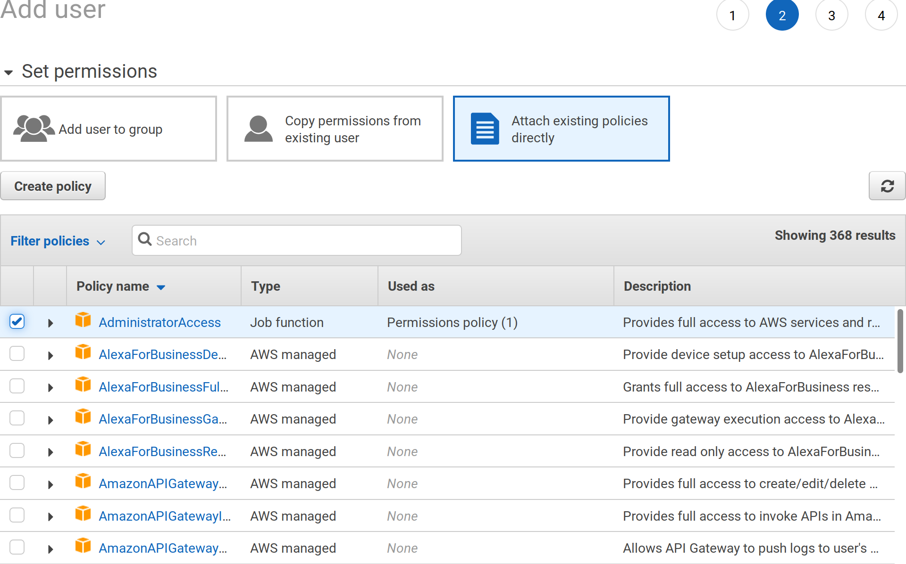

Grab your `access key ID` and `secret access key`, you'll be asked for those values later on:


We need to add additional permissions on that user, this is going to be needed later on as well when configuring our GIT repository:

Go to the `Security credentials` tab on the user summary detail and click the `Generate` button under *HTTPS Git credentials...*


Again, a new pair of user/password will be generated, save theses for later:

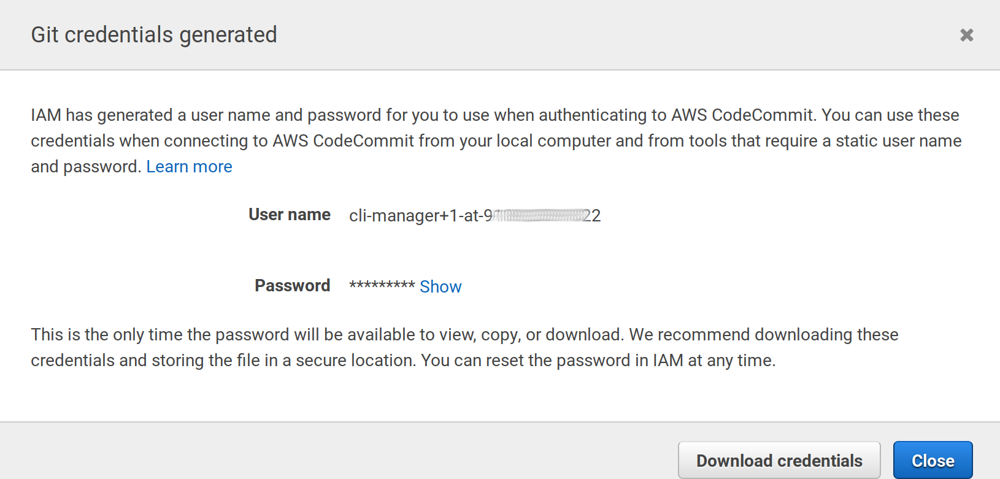

### 2.2 Install the command line elasticbeanstalk:

In Linux systems, use `pip` (the python manager, Python 2.7 required):
```bash
pip install awsebcli --upgrade --user
```

In MacOS you can use [homebrew](https://brew.sh/):
```bash
brew update
brew install aws-elasticbeanstalk
```

> If your are using Windows, I'd recommend to install to use the Windows Subsytem for Linux and use the Linux instructions when required:
> https://docs.microsoft.com/en-us/windows/wsl/install-win10

Be sure to have the tool properly installed:

```bash
$ eb --version
EB CLI 3.14.6 (Python 2.7.1)
```

Read the [official documentation](https://docs.aws.amazon.com/elasticbeanstalk/latest/dg/eb-cli3-install.html) about this tool is you have problems.


## 3. Initialize ElasticBeanstalk

We are going to initialize ElasticBeanstalk in our Decidim copy, after that deploying will involve a simple command everytime we make a change.

```bash
cd ~/decidim-app
eb init
```

This is going to ask many questions:

Choose a region (Choose 1 for free SSL services)

```
Select a default region
1) us-east-1 : US East (N. Virginia)
2) us-west-1 : US West (N. California)
3) us-west-2 : US West (Oregon)
4) eu-west-1 : EU (Ireland)
5) eu-central-1 : EU (Frankfurt)
6) ap-south-1 : Asia Pacific (Mumbai)
7) ap-southeast-1 : Asia Pacific (Singapore)
8) ap-southeast-2 : Asia Pacific (Sydney)
9) ap-northeast-1 : Asia Pacific (Tokyo)
10) ap-northeast-2 : Asia Pacific (Seoul)
11) sa-east-1 : South America (Sao Paulo)
12) cn-north-1 : China (Beijing)
13) cn-northwest-1 : China (Ningxia)
14) us-east-2 : US East (Ohio)
15) ca-central-1 : Canada (Central)
16) eu-west-2 : EU (London)
17) eu-west-3 : EU (Paris)
(default is 3): 4
```

Then you'll be asked to configure the credentials we've generated in the step **2.1**:
```
You have not yet set up your credentials or your credentials are incorrect
You must provide your credentials.
(aws-access-id): AKI**************BTQ
(aws-secret-key): YLvUbS****************OviQZkl
```

A name for your application in AWS (put whatever you want or leave empty for the default):

```
Enter Application Name
(default is "decidim-app"):
Application decidim-app has been created.
```

As docker is pre-configured in Decidim, EB will think it should use it, as I don't think is ready for production sites, answer **no**:

```
It appears you are using Docker. Is this correct?
(Y/n): n
```

Then choose the right platform (choose `Ruby` and `Ruby 2.5 (Passenger Standalone)`):

```
Select a platform.
1) Node.js
2) PHP
3) Python
4) Ruby
5) Tomcat
6) IIS
7) Docker
8) Multi-container Docker
9) GlassFish
10) Go
11) Java
12) Packer
(default is 1): 4

Select a platform version.
1) Ruby 2.5 (Passenger Standalone)
2) Ruby 2.5 (Puma)
3) Ruby 2.4 (Passenger Standalone)
4) Ruby 2.4 (Puma)
5) Ruby 2.3 (Passenger Standalone)
6) Ruby 2.3 (Puma)
7) Ruby 2.2 (Passenger Standalone)
8) Ruby 2.2 (Puma)
9) Ruby 2.1 (Passenger Standalone)
10) Ruby 2.1 (Puma)
11) Ruby 2.0 (Passenger Standalone)
12) Ruby 2.0 (Puma)
13) Ruby 1.9.3
(default is 1): 1
```

We're are going to use the CodeCommit service as a remote origin to our GIT repository, now we are going to be asked about the creation of that repository:

```
Note: Elastic Beanstalk now supports AWS CodeCommit; a fully-managed source control service. To learn more, see Docs: https://aws.amazon.com/codecommit/
Do you wish to continue with CodeCommit? (y/N) (default is n): y

Enter Repository Name
(default is "codecommit-origin"): decidim-app
Successfully created repository: decidim-app

Enter Branch Name
***** Must have at least one commit to create a new branch with CodeCommit *****
(default is "master"): master
```

Now we will be asked for a username to connect to the codecommit service, we are going to use the ones created in the `Security credentials` step, section **2.1** (Password won't be visible when you paste it):

```
Username for 'https://git-codecommit.eu-west-1.amazonaws.com/v1/repos/aws': cli-manager+1-at-9*******22
Password for 'https://cli-manager@git-codecommit.eu-west-1.amazonaws.com/v1/repos/aws':
Successfully created branch: master
```

Then, we need to configure SSH access to our instances, this step will generate a public/private rsa key. We are going to use this key to access the generated server without needing to type a password every time.

```
Do you want to set up SSH for your instances?
(Y/n): Y
Type a keypair name.
(Default is aws-eb):
Generating public/private rsa key pair.
Enter passphrase (empty for no passphrase):
Enter same passphrase again:
Your identification has been saved in /home/ivan/.ssh/aws-eb.
Your public key has been saved in /home/ivan/.ssh/aws-eb.pub.
The key fingerprint is:
SHA256:PK************************************ aws-eb
The key's randomart image is:
+---[RSA 2048]----+
|.. .o.+          |
|+.oo + .         |
|++= o o . o      |
|o= o = = B       |
|o . +.+ S =      |
|    o= o X o     |
|   ...E o +      |
|   ooo.o         |
|   .+oo          |
+----[SHA256]-----+
WARNING: Uploaded SSH public key for "aws-eb" into EC2 for region eu-west-1.
```

---

The `init` command will end here. Now, we could push our code to the server, but we will be asked for the password every time (because it's being configure as a HTTPS repository). To change that, we are going to change the generated GIT configuration file so we will use SSH configuration and use the previously generated key pair.

The generated key pair is stored in a hidden folder in your home directory (`/home/ivan/.ssh` in my case), to go there type:

```bash
cd ~/.ssh
```

You'll see there 2 files (at least), `aws-eb` and `aws-eb.pub`, you need to copy the content of the second one (`aws-eb.pub`).

In MacOS do:

```bash
pbcopy ~/.ssh/aws-eb.pub
```
In Linux:

```
xclip -selection clipboard ~/.ssh/aws-eb.pub
```

Then go to the IAM console of AWS (same place where we've created our user in section **2.1**) in https://console.aws.amazon.com/iam/home, edit our user under the `Secutiry credentials` section and click on the button `Upload SSH public key`. Paste the code copied and close the pop up.


Once uploaded, you'll get a new SSH Key ID, this is a username we are going to need in the next step:

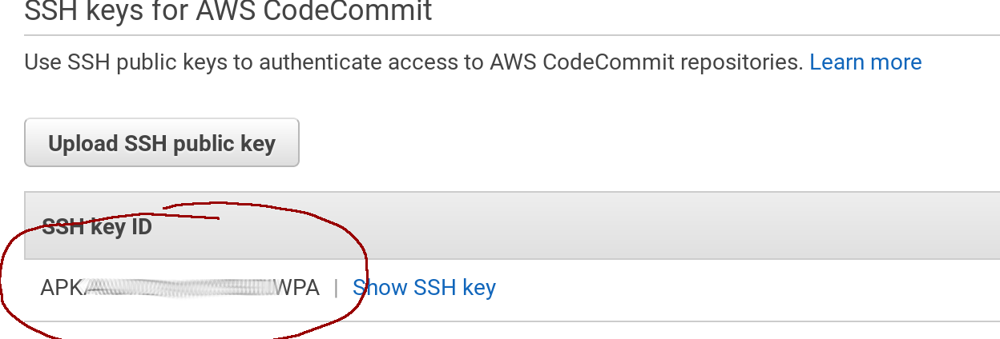

Now we are going to reconfigure GIT in order to use SSH instead of HTTPS. You will need to run these 2 commands, but be aware that you may need to change the `eu-west-1` zone if you chose a different one in the beginning of section **3**:

```
git remote set-url codecommit-origin ssh://git-codecommit.eu-west-1.amazonaws.com/v1/repos/decidim-app
git remote set-url --push codecommit-origin ssh://git-codecommit.eu-west-1.amazonaws.com/v1/repos/decidim-app
```

As we've created a specific key pair for SSH authentication, we need to configure GIT globally in order to use those in the amazon servers. We must add these lines to the file `~/.ssh/config` (create the file if does not exists):

Use the editor `nano` (or another):

```bash
nano ~/.ssh/config
```

And paste the next lines by replacing the User code by the one created after uploading the SSH public key in the previous step:

```
Host git-codecommit.*.amazonaws.com
  User APK**************WPA
  IdentityFile ~/.ssh/aws-eb
```

You can test if everything is ok by creating a new commit after EB initialization:

```bash
$ git add .
$ git commit -m "Post EB init"
[master b999def] Post EB init
 1 file changed, 5 insertions(+), 1 deletion(-)
$ git push
Everything up-to-date
```

You may want to check the [official guide](https://docs.aws.amazon.com/codecommit/latest/userguide/setting-up-ssh-unixes.html) for further info.

## 4. Configure the environment in ElasticBeanstalk

We are going to create the environment, we can create as many as we want, typically: staging, development and production. In our case we will deal with the production one.

### 4.1 Creating the environment

ElasticBeanstalk, let's run the command:

```bash
cd ~/decidim-app
eb create production
```

This is going to take a while...
The output will be something like this:

```
Starting environment deployment via CodeCommit
--- Waiting for Application Versions to be pre-processed ---
Finished processing application version app-b999-181030_184555
Setting up default branch
Environment details for: production
  Application name: decidim-app
  Region: eu-west-1

...

/opt/elasticbeanstalk/hooks/appdeploy/pre/11_asset_compilation.sh failed. For more detail, check /var/log/eb-activity.log using console or EB CLI.
2018-10-30 17:52:12    INFO    Command execution completed on all instances. Summary: [Successful: 0, Failed: 1].
2018-10-30 17:53:14    ERROR   Create environment operation is complete, but with errors. For more information, see troubleshooting documentation.
```

As you can see it failed while trying to deploy, but that's normal because we need to set up some environment variables. The production environment should be created anyway. We can test it by executing:

```
$ eb status
Environment details for: production
  Application name: decidim-app
  Region: eu-west-1
...
  Status: Ready
  Health: Red
Current CodeCommit settings:
  Repository: decidim-app
  Branch: master
```

Specifically, we need to specify the rails secret in a `env` variable:

```bash
eb setenv SECRET_KEY_BASE=$(bin/rails secret)
```

The result should be:

```
018-10-30 18:00:07    INFO    Environment update is starting.
2018-10-30 18:00:16    INFO    Updating environment production's configuration settings.
2018-10-30 18:01:29    INFO    Successfully deployed new configuration to environment.
```

Now, we are going to create a database tied to ElasticBeanstalk. First, let's configure our Decidim application in order to use the proper credentials for that.

Edit the file `config/database.yml` in our `decidim-app` folder:

```bash
nano ~/decidim-app/config/database.yml
```

And paste this code (replace existing lines after `production:`):

```ruby
production:
    <<: *default
    adapter: postgresql
    encoding: unicode
    database: <%= ENV['RDS_DB_NAME'] %>
    username: <%= ENV['RDS_USERNAME'] %>
    password: <%= ENV['RDS_PASSWORD'] %>
    host: <%= ENV['RDS_HOSTNAME'] %>
    port: <%= ENV['RDS_PORT'] %>
```

And create a new commit:

```bash
git add .
git commit -m "set database config for EB"
git push
```

Now, let's create the AWS PostgreSQL database:

1. Go to https://console.aws.amazon.com/elasticbeanstalk/home?region=eu-west-1#/applications

1. Click on the `production` box under the `decidim-app` application

1. Click on `Configuration` in the left menu and then scroll down until the box `Database`, click on `modify`.

1. Create a PostgreSQL database, choose the instance (`db.t2.micro` for minimal costs), a username and a password: 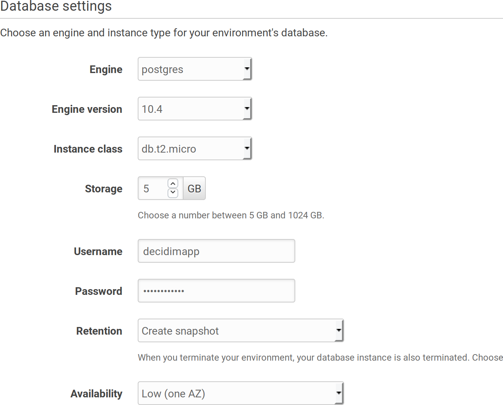

1. This is going to take a while as well...

> An alternative way to create the database is to go to the RDS section in AWS and create it there outside the scope of ElasticBeanstalk.
>
> This way, if you destroy your EB environment, your database won't be affected.
>
> This approach may be safer for some, specially if you want to deploy your application without downtime (using 2 production environments).
>
> If you want to follow this approach, you need to manually create a RDS Posgress Database and manually add the security group to allow EB access to it. Then create the environment varials `RDS_*` manually with the database credentials.
>
> 👉 Check the appendix for how to configure an external RDS database

### 4.2 Add Swap memory to the container

Deploying a Ruby app may require a lot of memory, specially when gems are installed. It is highly recommended to add some swap memory to it to ensure the deploy process is going to be smooth.

To do that, we need to create a custom extension that will tell EB what to do when creating a container:

Create a folder named `.ebextensions` and a file named `01_swap.config` in it:

```bash
mkdir .ebextensions
nano .ebextensions/01_swap.config
```

Paste this content in that file:

```yaml
commands:
  01setup_swap:
    test: test ! -e /swapfile
    command: |
      /bin/dd if=/dev/zero of=/swapfile bs=1M count=3072
      /bin/chmod 600 /swapfile
      /sbin/mkswap /swapfile
      /sbin/swapon /swapfile
```

Create a commit:

```bash
git add .
git commit -m "Add swap file"
git push
```

### 4.3 Add required libraries to ELB machines

Since version 0.17, the package `libicu-dev` is required and is not installed by default in AWS machines. To enable it we need to create another file inside the `.ebextensions` folder:

```bash
mkdir .ebextensions
nano .ebextensions/02_packages.config
```

With this content:

```yaml
packages:
  yum:
    git: []
    libicu-devel: []
```

Create a commit:

```bash
git add .
git commit -m "Add required libraries"
git push
```

## 5. Deploying Decidim

When the database is created, we are ready to deploy our first version of Decidim, just type the command:

```bash
eb deploy
```

Result shoud be something like:
```
Starting environment deployment via CodeCommit
--- Waiting for Application Versions to be pre-processed ---
Finished processing application version app-b5ea-181031_105343
2018-10-31 09:53:53    INFO    Environment update is starting.
2018-10-31 09:53:58    INFO    Deploying new version to instance(s).
2018-10-31 09:57:36    INFO    New application version was deployed to running EC2 instances.
2018-10-31 09:57:36    INFO    Environment update completed successfully.
```

Great!! we are up an running! We can now navigate by using our provisional URL provided by AWS.

You can type in the console:

```bash
eb open
```

And your browser will open the page automatically. You will see the system login page:


Still many things need to be configured (main url, ssl email, first user, etc) though. We'll do that in the next section.

On the the other hand, once we initialized and configured ElasticBeanstalk, every time we make a modification in our code, we just need to create a GIT commit and deploy to EB, summarized:

```bash
git add .
git commit -m "My custom change"
git push
eb deploy
```

## 6. Further configuration

We've successfully deploy our Decidim copy in ElasticBeanstalk, but to really be able to use it, we need to provide fully qualified domain name and configure the most basic things. Similar as the [original guide](decidim-bionic.md) but with some particularities regarding EB ans AWS.

### 6.1 Set the domain in EB

There's 2 ways to go, the first (easiest) is to use the service Route53 from AWS that let's you register the domain and configure it according to [this guide](https://docs.aws.amazon.com/elasticbeanstalk/latest/dg/customdomains.html).

The second is to use an external provider (ie: if you already have a domain). In this case we should follow these steps:

1. Login to your Domain register provider

1. Go to your DNS records administration

1. Add a CNAME record `www` that points to your environment just created (the same where your browser goes when you execute the command `eb open`). Something like `production.k*********.eu-west-1.elasticbeanstalk.com`

1. Redirect the main domain to the `www` one (if you want to).

If you are using [Cloudflare](https://clourflare.org) it should be something like:

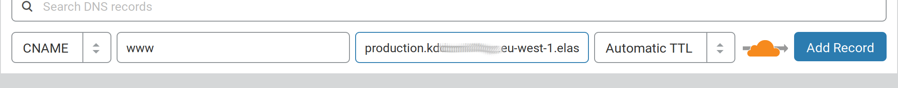

### 6.2 Configure SSL

You can issue a free-SSL certificate from Amazon directly (or you can upload one you have). To do that go to:

https://eu-west-1.console.aws.amazon.com/acm/home?region=eu-west-1#/wizard/

And follow the steps, first introduce your domain name:


Then choose a validation method:

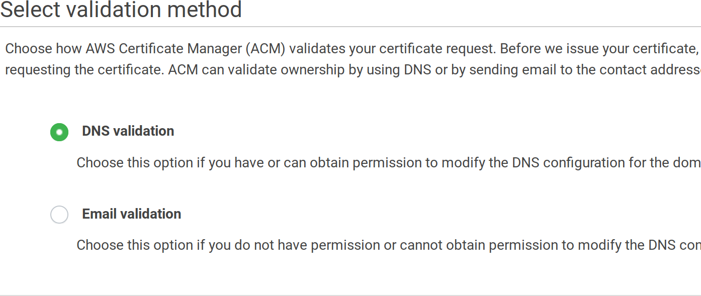

Finally, review it and finalize the process. If you've chosen the DNS validation you will need to add an additional CNAME entry in your DNS provider, copy the values from the screen, something like:

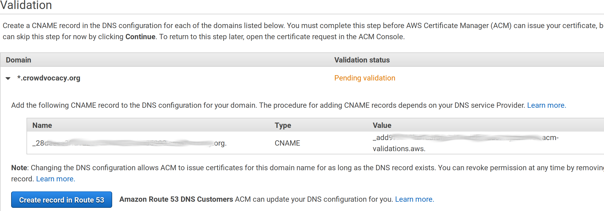

After a while, your domain will be validated. Then we need to configure the load balancer on ElasticBeanstalk to use it:

1. Go to https://console.aws.amazon.com/elasticbeanstalk/home?region=eu-west-1#/applications

1. Click on the `production` box under the `decidim-app` application

1. Click on `Configuration` in the left menu and then scroll down until the box `Load Balancer`, click on `modify`.

Then add a listener:


Fill in the values, use `HTTPS` and `443` for the listener port and `80` and `HTTP` for the instance port. Also choose your generated certificate from the dropdown:


When the popup is closed don't forget to click on the `Apply` button at the end of the page.

After a while you will be able to navigate securely to your own `https://` domain.

Now, if you want to redirect all the traffic to the secure site, the easiest way to do it is to configure your copy of Decidim to do so.

Edit the file `config/environments/production.rb` and uncomment the line `# config.force_ssl = true`:

```bash
nano ~/decidim-app/config/environments/production.rb
```

Remove the `#` symbol from the line:

```
...
config.force_ssl = true
...
```

As anytime we make a change create a commit and push and deploy:

```
git add .
git commit -m "Force SSL"
git push
eb deploy
```

Done, now all petitions to `http://` will redirect to `https://`

### 6.3 Create the first admin user

We didn't seed any data to our installation, so we need at least one system user in order to configure our first organization. Also, we cannot access our PostgreSQL database directly, so these are the steps:

First we need lo log into production machine via ssh, we do that with this command:

```bash
eb ssh
```

Once inside, we change to the app working dir:

```bash
cd /var/app/current/
```

Then, log into the rails console:

```bash
bin/rails console
```

And create the user:

```ruby
email = "my-admin@email"
password = "<a secure password>"
user = Decidim::System::Admin.new(email: email, password: password, password_confirmation: password)
user.save!
```
Write `quit` or press *CTRL+D* to exit the rails console.

Write `exit` to return to your computer.

You can log now with this user into your https://your-domain.com/system and create your organization.


### 6.4 Setup email

As we are using Amazon Web Services, we will configure Amazon SES to send emails (of course you can use SES in other configurations, even without using any other AWS service).

First, we need to configure SES and validate our FROM email.

1. Go to https://eu-west-1.console.aws.amazon.com/ses/home?region=eu-west-1#

1. Click on the `Email addresses` left menu item

1. Click on the `Verify a New Email Address` button

1. Enter your email address that will be used as FROM in your Decidim communications (it doesn't have to be on the same domain, it can be any email address)

1. You should receive an email from Amazon. Open your email inbox and click on the link specified to verify your address. You can verify a whole domain as well (so all the addresses in that domain will be verified).

1. You can repeat this process with many emails as you want. By default, SES is configured to work only on verified emails.

1. Next step is to configure the SMTP server, go to `SMTP settings` and click the button `Create my SMTP Credentials`:<br>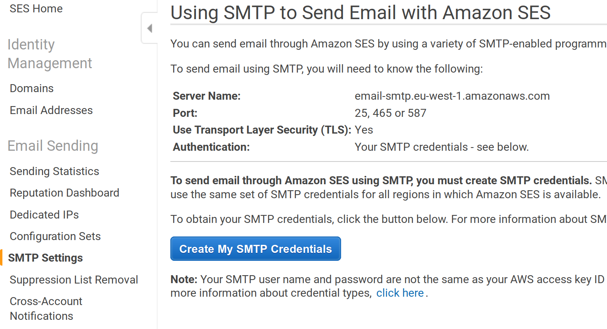

1. Next screen will show you a username that's going to be created, just accept it and click the button `Create`. Then click on the `Show User SMTP Security Credentials` and copy the generated credentials:<br>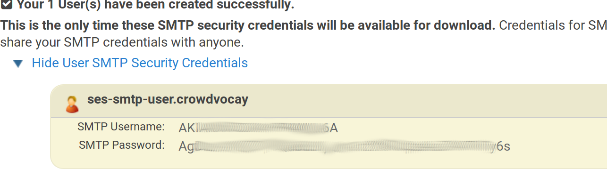

We need now to set up the environment variables with these SMTP values. We do that with the `eb` tool (change the values according your generated settings):

```bash
eb setenv SMTP_USERNAME=AK**************A
eb setenv SMTP_PASSWORD=Ag****************************6s
eb setenv SMTP_ADDRESS=email-smtp.eu-west-1.amazonaws.com
eb setenv SMTP_DOMAIN=mail.my-domain.org
```

Done, Decidim is properly configured to send emails where the `from/to` are in the verified addresses in AWS SES. Now, remember that SES is configured in Sandbox mode by default, we should request an increase of sending limits to use it in the real world:

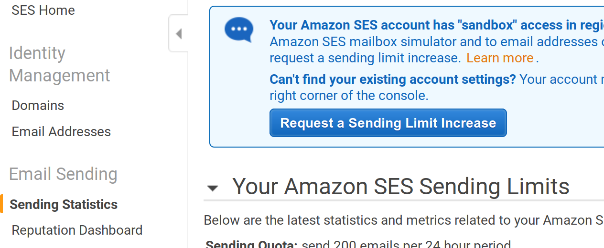

Also, when using SES you need to keep track of bounces and complaints, and keep them low otherwise they can ban you. More info on that [here](http://docs.aws.amazon.com/ses/latest/DeveloperGuide/best-practices-bounces-complaints.html).

And, finally, we should configure Decidim our FROM default email. We do that in the file `config/initializers/decidim.rb`, let's edit the file, create a commit, and deploy:

```bash
nano config/initializers/decidim.rb
```

Change the lines:

```ruby
  config.application_name = "My Application Name"
  config.mailer_sender = "change-me@domain.org"
```

To match your settings (use a verified SES address). Then create the commits and deploy:

```bash
git add .
git commit -m "Default FROM email"
git push
eb deploy
```

We still need to configure a Job processor in Ruby on Rails, that will actually send the emails (the email processing system creates a queue that we need to process). The next (last) step is to do that.

### 6.5 Configure the job system with Sidekiq and Redis

We going to use Sidekiq instead of the "delayed_job" method we use in the [basic config](basic-config.md). This is a more common setup for production sites and it uses Redis as a backend storage for the jobs queue.

1. First, we need to create a Redis database in AWS. To do that we need to go to https://console.aws.amazon.com/elasticache/home?region=eu-west-1#redis

1. Create a minimal Redis database (choose instance `t2.micro`). Configure the subnet to use our same AWS zone (eu-west-1 in this tutorial):<br>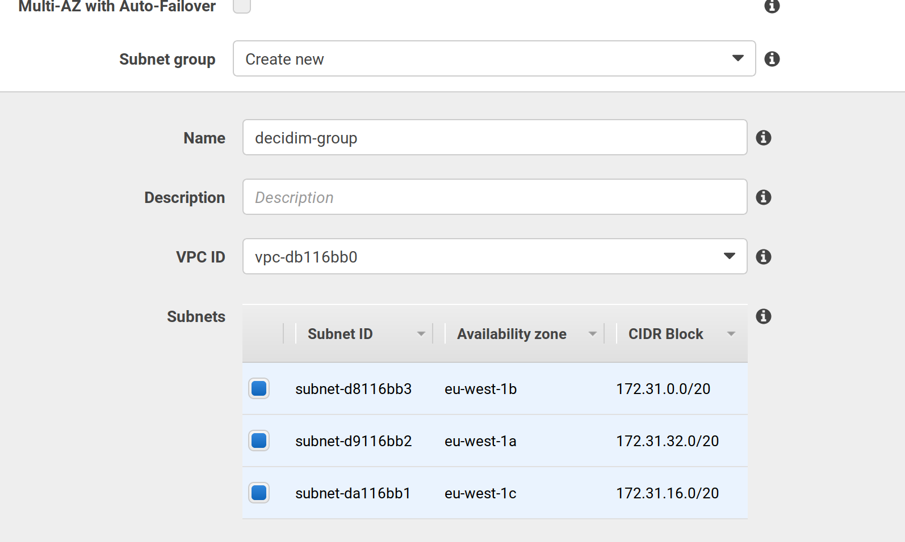

1. Choose, under the `Security group` select, the same group where your elastic beanstalk PosgreSQL is. Otherwise, the server won't be able to access to the database. If you search for rds, you probably find that group as the first option:<br>

1. Press all necessary `Save` and `Create` buttons. While redis is creating, we must modify the security group to allow connections to the port Redis is using. To do that we need to go to the EC2 security mangament in https://eu-west-1.console.aws.amazon.com/ec2/v2/home?region=eu-west-1#SecurityGroups:sort=groupId. There you need to edit the same rule you just applied in the step before, In the `Inbound` tab, click `Edit` and add a rule with the port 6379 where source is exactly the same as the PostgreSQL rule:<br>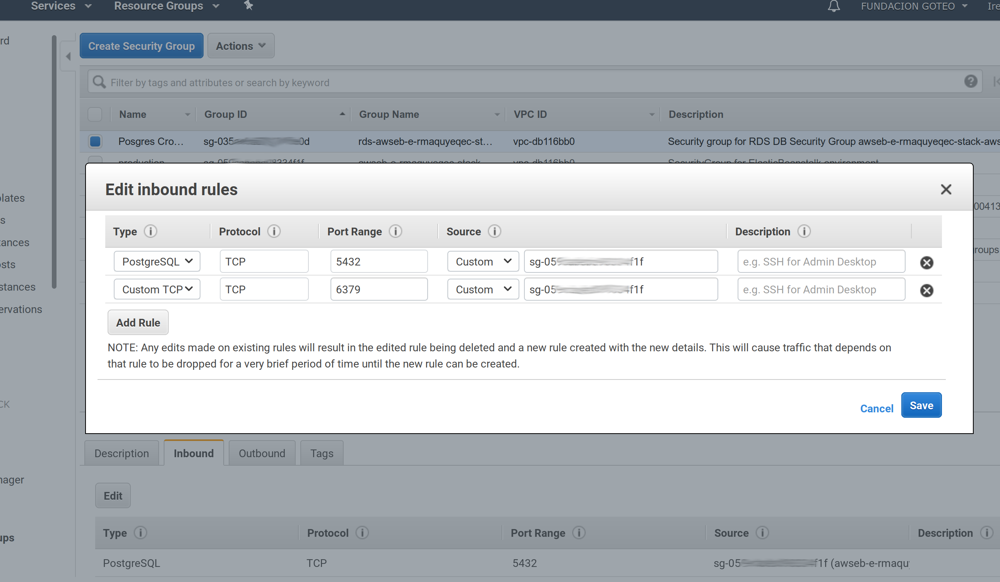


1. Once created a endpoint will be generated with our Redis instance (something like c********.******.ng.0001.euw1.cache.amazonaws.com:6379).

1. We need to add the gem `sidekit` to our Gemfile, edit the file and add a `:production` section:

```bash
nano Gemfile
```

Add the `:production` section with the needed Gem if does not exists:

```ruby
...
group :production do
  gem "sidekiq"
end
```

Now, we need to configure Decidim to use the sidekiq ActiveJob adapter. We need to edit the file `config/environments/production.rb`:

```bash
nano config/environments/production.rb
```

Add at the end of the file (before the end statement):

```ruby
...
  config.active_record.dump_schema_after_migration = false
  # Specify active_job sidekiq adapter
  config.active_job.queue_adapter = :sidekiq
end
```

Also, IYou need to specify which queues sidekiq is going to process (otherwise only the `default` queue is going to be processed), it seems that Decidim uses at last 6 queues, so we need to create a new file `config/sidekiq.yml` specifying those queues:

Create the file:

```bash
nano config/sidekiq.yml
```

Put this content in it:

```yaml
:concurrency: 6
:queues:
  - default
  - mailers
  - newsletter
  - newsletters_opt_in
  - events
  - metrics
```

> 👉 **Advanced tip**: you can configure a controller (accessible only to Decidim admins) to view the status of the queues used in sidekiq
>
> To do that edit the file `config/routes.rb` and ensure that it begins with:
> ```ruby
> # frozen_string_literal: true
>
> require "sidekiq/web"
>
> Rails.application.routes.draw do
>
>  authenticate :user, ->(u) { u.admin? } do
>    mount Sidekiq::Web => "/sidekiq"
>  end
> ...
> ```
>
> Now, when deployed, you will be able to access to your-domain.org/sidekiq to see the status of your queues

Now, we need to ensure that the sidekiq processor starts with our instances, to do that we are going to use ElasticBeanstalk extensions, that allows us to add files and services to the instances serving our application. In our case, we need to make sure to start/restart sidekiq in every deployment.

We need to create a folder named `.ebextensions` (if does not exists yet)and a file named `02_sidekiq.config` inside it:

```bash
mkdir .ebextensions
nano .ebextensions/02_sidekiq.config
```

Then, in that folder add a file `` with this content (Find the original code in https://gist.github.com/ssaunier/44bbebb9c0fa01953860):

```yaml
# Sidekiq interaction and startup script
commands:
  create_post_dir:
    command: "mkdir -p /opt/elasticbeanstalk/hooks/appdeploy/post"
    ignoreErrors: true
files:
  "/opt/elasticbeanstalk/hooks/appdeploy/post/50_restart_sidekiq.sh":
    mode: "000755"
    owner: root
    group: root
    content: |
      #!/usr/bin/env bash
      . /opt/elasticbeanstalk/support/envvars

      EB_APP_DEPLOY_DIR=$(/opt/elasticbeanstalk/bin/get-config container -k app_deploy_dir)
      EB_APP_PID_DIR=$(/opt/elasticbeanstalk/bin/get-config container -k app_pid_dir)
      EB_APP_USER=$(/opt/elasticbeanstalk/bin/get-config container -k app_user)
      EB_SCRIPT_DIR=$(/opt/elasticbeanstalk/bin/get-config container -k script_dir)
      EB_SUPPORT_DIR=$(/opt/elasticbeanstalk/bin/get-config container -k support_dir)

      . $EB_SUPPORT_DIR/envvars
      . $EB_SCRIPT_DIR/use-app-ruby.sh

      SIDEKIQ_PID=$EB_APP_PID_DIR/sidekiq.pid
      SIDEKIQ_CONFIG=$EB_APP_DEPLOY_DIR/config/sidekiq.yml
      SIDEKIQ_LOG=$EB_APP_DEPLOY_DIR/log/sidekiq.log

      cd $EB_APP_DEPLOY_DIR

      if [ -f $SIDEKIQ_PID ]
      then
        su -s /bin/bash -c "kill -TERM `cat $SIDEKIQ_PID`" $EB_APP_USER
        su -s /bin/bash -c "rm -rf $SIDEKIQ_PID" $EB_APP_USER
      fi

      . /opt/elasticbeanstalk/support/envvars.d/sysenv

      sleep 10

      su -s /bin/bash -c "bundle exec sidekiq \
        -e $RACK_ENV \
        -P $SIDEKIQ_PID \
        -C $SIDEKIQ_CONFIG \
        -L $SIDEKIQ_LOG \
        -d" $EB_APP_USER

  "/opt/elasticbeanstalk/hooks/appdeploy/pre/03_mute_sidekiq.sh":
    mode: "000755"
    owner: root
    group: root
    content: |
      #!/usr/bin/env bash
      . /opt/elasticbeanstalk/support/envvars

      EB_APP_USER=$(/opt/elasticbeanstalk/bin/get-config container -k app_user)
      EB_SCRIPT_DIR=$(/opt/elasticbeanstalk/bin/get-config container -k script_dir)
      EB_SUPPORT_DIR=$(/opt/elasticbeanstalk/bin/get-config container -k support_dir)

      . $EB_SUPPORT_DIR/envvars
      . $EB_SCRIPT_DIR/use-app-ruby.sh

      SIDEKIQ_PID=$EB_APP_PID_DIR/sidekiq.pid
      if [ -f $SIDEKIQ_PID ]
      then
        su -s /bin/bash -c "kill -USR1 `cat $SIDEKIQ_PID`" $EB_APP_USER
      fi
```

Create a commit and deploy:

```bash
git add .
git commit -m "Added Sidekiq"
git push
```

Before deploy, let's add the env variable with the Redis url generated previously:

```
eb setenv REDIS_URL=redis://******.78gooe.ng.0001.euw1.cache.amazonaws.com:6379
eb deploy
```

That should be all. From now we must be receiving emails from our Decidim installed in ElasticBeanstalk with ease.

### 6.6 File storage

By default any file uploaded to our Decidim will be stored locally in our server instance created by AWS. As this instances may be ephemeral, we will configure file storage using the centralized service S3 from AWS.

First, let's configure AWS S3 to add a bucket where to store our files.

1. Go to https://s3.console.aws.amazon.com/s3/home?region=eu-west-1

1. Press the `Create bucket` button, and create a bucket for our Decidim. Choose a name like `my-decidim`. Choose the region `EU (Ireland)` to match all configurations in this tutorial (this is important when configuring Decidim).

1. Create a key/secret pair for this bucket. Go to https://console.aws.amazon.com/iam/home?#home and then to the `Policies` menu. Add a new policy, choose `S3` as service, then `All S3 actions (s3:*)`. Then in the `Resources` section, write your bucket when requested in the `bucket` and `object` subsections:
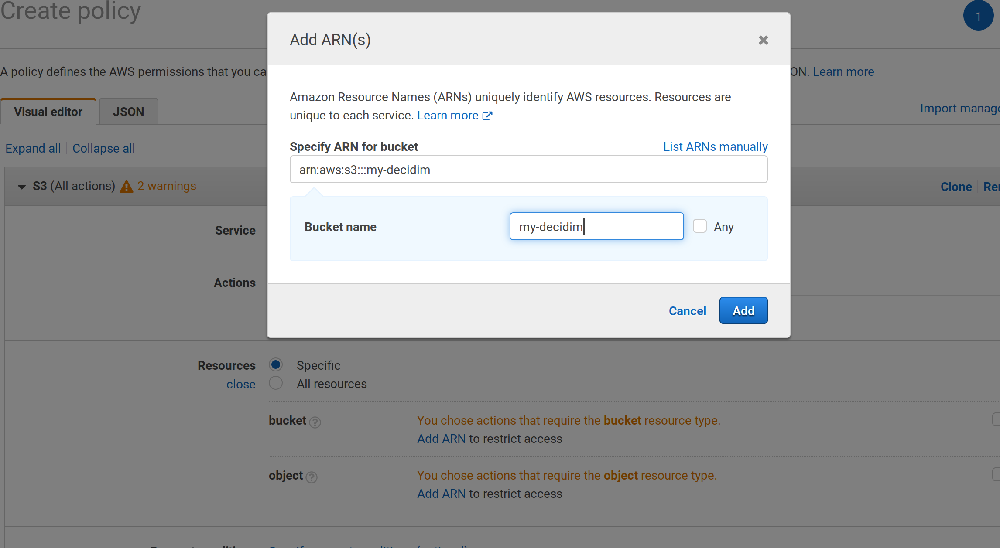
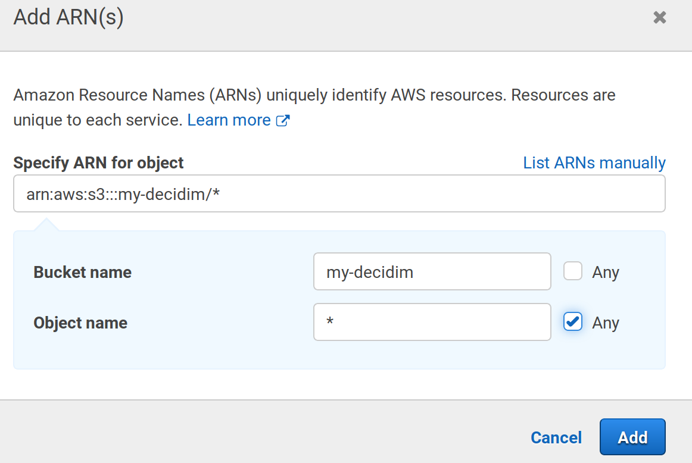

1. Finish the policy (give it a nice name) and go to the `Users` section in the main menu, press the `Add user` and choose `Programmatic access` when requested.

1. Choose `Attach policies directly` and then search for the policy we've made just before. Review and create the user.

1. Download the credentials and, with the `eb` tool, create the env variables with those credentials:

```bash
eb setenv AWS_ACCESS_KEY_ID=************
eb setenv AWS_SECRET_ACCESS_KEY=**************
```

Now it's time to configure our Decidim to use those values.

First, let's add the Gem `fog-aws` into the `Gemfile`, section `:production`:

```bash
nano Gemfile
```

Leave it like this:

```ruby
...
group :production do
  gem "sidekiq"
  gem "fog-aws"
end
```

Now, we need to edit the file `config/initializers/carrierwave.rb` and edit the values.

```bash
nano config/initializers/carrierwave.rb
```

Remove the whole `Carrierwave.configure` section and leave it like this (change the bucket name to match yours):

```ruby
...
if Rails.application.secrets.aws_access_key_id.present?
  require "carrierwave/storage/fog"

  CarrierWave.configure do |config|
    config.storage = :fog
    config.fog_provider = 'fog/aws'
    config.fog_credentials = {
      provider:              'AWS',
      aws_access_key_id:     Rails.application.secrets.aws_access_key_id,
      aws_secret_access_key: Rails.application.secrets.aws_secret_access_key,
      region:                'eu-west-1',
      host:                  's3.eu-west-1.amazonaws.com',
      # endpoint:              'https://s3.example.com:8080'
    }
    config.fog_directory  = ENV.fetch("AWS_BUCKET_NAME", 'your-bucket-name')
    # config.fog_public     = false
    config.fog_attributes = {
      'Cache-Control' => "max-age=#{365.day.to_i}",
      'X-Content-Type-Options' => "nosniff"
    }
  end
end
```

Also, edit the file `config/secrets.yml`:

```bash
nano config/secrets.yml
```

Add these 2 lines under the section `&default`:

```yaml
...
default: &default
  aws_access_key_id: <%= ENV["AWS_ACCESS_KEY_ID"] %>
  aws_secret_access_key: <%= ENV["AWS_SECRET_ACCESS_KEY"] %>
...
```

Create a commit and deploy:

```bash
git add .
git commit -m "Add S3 bucket configuration"
git push
eb deploy
```

Done! You can go to the [Basic Config](basic-config.md) (skip the email step) and configure the social login and here maps. Remember to commit and deploy every time you change a a file, also, use `eb sentenv` to create environment variables in your instances.


## 7. Appendix: Using an external database

Using an external database provides some advantages:

- First, it is more secure as you can destroy your environments an recreate them without affecting your data (otherwise your database will be destroyed as well).

- Second, you can deploy you application in the so called [blue/green technique](https://docs.aws.amazon.com/elasticbeanstalk/latest/dg/using-features.CNAMESwap.html), which is, basically, having 2 production environments and activating one while the other is updating.

So, in this appendix, instead of using the Elastic Beanstalk included database, we will create one manually in the RDS service of AWS. This corresponds to the end of the **step 4**.

1. Go to https://eu-west-1.console.aws.amazon.com/rds/home?region=eu-west-1#

1. Click on the `Create database` button, choose `PostgreSQL`, then specify the identifier of the database (not the database's name), username and password:


1. In the next step, you need to choose the security group for the database. We should use the same security group as our created environment, you can find which security group are you using if you go to https://eu-west-1.console.aws.amazon.com/elasticbeanstalk/home?region=eu-west-1#/applications, choose `production`, go to `Configuration`, press on the box `Instances` and look for the checked line:


1. So, choose the option `Choose existing VPC security groups` and mark the same as the instance you found before:


1. Also choose the database name and click any additional steps to complete the process. Once created, take note of the generated endpoint, it is the hostname needed for the application to connect to (something like `decidimapp.********.eu-west-1.rds.amazonaws.com`).

1. Finally, you'll need to modify the security group in order to add an Inbound rule, same as we did with the REDIS section. In this case add the port 5432 (which is the PostgreSQL).

Now, you need to set up the environment variables manually, run these commands with your own data:

```bash
eb setenv RDS_DB_NAME=decidimapp
eb setenv RDS_USERNAME=decidimapp
eb setenv RDS_PASSWORD=your-password
eb setenv RDS_HOSTNAME=decidimapp.********.eu-west-1.rds.amazonaws.com
eb setenv RDS_PORT=5432
```

