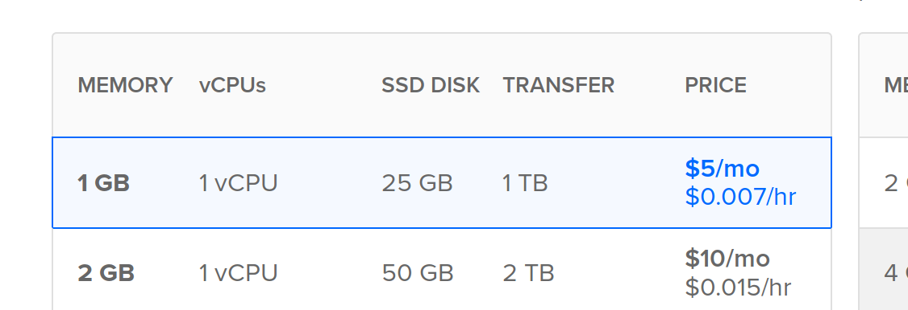

Install Decidim on Ubuntu 18.04
===============================

These instruction should work in any clean installation of Ubuntu 18.04. You may have to adapt some of the step in other cases.

## 1. Setup a clean server

Use a clean installation, I'm using DigitalOcean for this example, you can get 2 months free for a 1G memory machine (used here) if you register with this referral:

https://m.do.co/c/b5a36733f0df

Then, create a 1G droplet:



> Once you've created the droplet, you will need a domain name, let's say you bought `my-decidim.org`, you'll need to point an **A** record in your DNS provider to the droplet public IP.

Then I'll recommend you to follow the guide from digitalocean in order to secure your server (this is valid in other providers too):

Follow these instructions using `decidim` instead of `sammy` as a user:
https://www.digitalocean.com/community/tutorials/initial-server-setup-with-ubuntu-18-04

After that, I'd recommend to add some swap memory in your server (this is not necessary if you create a bigger memory droplet). For low-memory droplets it seems to work better with swap.

To do that follow this tutorial as well:

https://www.digitalocean.com/community/tutorials/how-to-add-swap-space-on-ubuntu-18-04

From now one, I'll assume you have created a non-root user (with sudo capabilities) named `decidim` (but use whatever you want) and you are login in your machine, so you will see a bash prompt similar to this:

```bash
ssh decidim@my-decidim.org
Welcome to Ubuntu 16.04.4 LTS (GNU/Linux 4.4.0-127-generic x86_64)

 * Documentation:  https://help.ubuntu.com
 * Management:     https://landscape.canonical.com
 * Support:        https://ubuntu.com/advantage

  Get cloud support with Ubuntu Advantage Cloud Guest:
    http://www.ubuntu.com/business/services/cloud

51 packages can be updated.
31 updates are security updates.


The programs included with the Ubuntu system are free software;
the exact distribution terms for each program are described in the
individual files in /usr/share/doc/*/copyright.

Ubuntu comes with ABSOLUTELY NO WARRANTY, to the extent permitted by
applicable law.

To run a command as administrator (user "root"), use "sudo <command>".
See "man sudo_root" for details.

decidim@decidim:~$ 
```

Great, we have our server up and running. Now we install the required packages before installing decidim:

## 2. Installing necessary software

First, let's keep our system up to date:

```bash
sudo apt update
sudo apt upgrade
sudo apt autoremove
```

Now, configure the proper timezone for your server:

```bash
sudo dpkg-reconfigure tzdata
```

Then, install some required packages:

```bash
sudo apt-get install autoconf bison build-essential libssl-dev libyaml-dev libreadline6-dev zlib1g-dev libncurses5-dev libffi-dev libgdbm-dev
``` 
Now, let's install ruby, by using the [rbenv](https://www.digitalocean.com/community/tutorials/how-to-install-ruby-on-rails-with-rbenv-on-ubuntu-16-04) method


These are the commands you need to run if you follow the guide:

```bash
git clone https://github.com/rbenv/rbenv.git ~/.rbenv
echo 'export PATH="$HOME/.rbenv/bin:$PATH"' >> ~/.bashrc
echo 'eval "$(rbenv init -)"' >> ~/.bashrc
source ~/.bashrc
```

Now you should check if you have rbenv correctly installed, running the command `type rbenv` should give you this answer:

```bash
decidim@decidim:~$ type rbenv
rbenv is a function
rbenv () 
{ 
    local command;
    command="${1:-}";
    if [ "$#" -gt 0 ]; then
        shift;
    fi;
    case "$command" in 
        rehash | shell)
            eval "$(rbenv "sh-$command" "$@")"
        ;;
        *)
            command rbenv "$command" "$@"
        ;;
    esac
}
```

We still need to install ruby-build to simplify the installation of ruby:

```bash
git clone https://github.com/rbenv/ruby-build.git ~/.rbenv/plugins/ruby-build
```

At this point, you should be able to run the command `rbenv install -l` that will give you all ruby versions available:

```bash
decidim@decidim:~$ rbenv install -l
Available versions:
  1.8.5-p52
  1.8.5-p113
...
  topaz-dev
  truffleruby-1.0.0-rc2
  truffleruby-1.0.0-rc3
```

We are going to use version 2.5.1, so run these commands:

```bash
rbenv install 2.5.1
rbenv global 2.5.1
```
Now you can verify we have everything in order by running the command `ruby -v`:

```bash
decidim@decidim:~$ ruby -v
ruby 2.5.1p57 (2018-03-29 revision 63029) [x86_64-linux]
```

If everything is ok, we need to setup Gems, the package manager for Ruby, after that we will be ready to install Decidim.

To setup Gem, execute:

```bash
echo "gem: --no-document" > ~/.gemrc
gem install bundler
```

Again, you can test if everything is ok so far by running the command `gem evn home`

```bash
decidim@decidim:~$ gem env home
/home/decidim/.rbenv/versions/2.5.1/lib/ruby/gems/2.5.0
```

Great, now we have the basic server setup in place, next step is to install Decidim.

## 3. Installing Decidim

Decidim uses Postgresql as a SQL database, we are going to install it in this machine (more advanced configurations will use a separate server for the database):

```bash
sudo apt install -y postgresql libpq-dev
```

We also need NodeJS as a dependency for the decidim generator, in ubuntu 18.04 it's fine to install from the repositories:

```bash
sudo apt install -y nodejs
```
Now, we use the decidim generator to create our application. Note that you still need the package `libpg-dev` in order tu run the decidim generator (in case you install postgress in another server).

First, install the gem Decidim (this may take a while):

```bash
gem install decidim
```
Now, run the generator to create our app:

```bash
decidim decidim-app
```

At this point, we have created a new folder in `~/decidim-app` with our code. We need to setup the database now.

work-in-progress!!!!