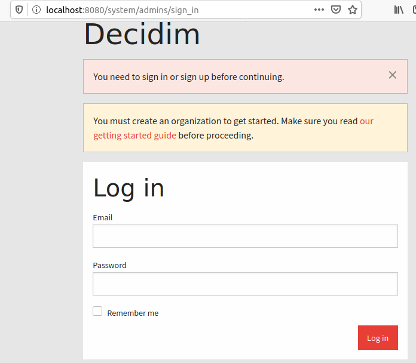

Decidim installation script
===========================

![[CI] Install Script](https://github.com/Platoniq/decidim-install/workflows/%5BCI%5D%20Install%20Script/badge.svg)

`install-decidim.sh` is a script that automates all the steps described in this guide.

- It is indented to be idempotent, meaning that it can be run safely many times in case of failure.
- It installs Decidim up to the point that it is up and running as a website. It does not configure extra services (such as SMTP or Geolocation). 
- It does not configure SSL.
- It does not configure any firewall (ie `ufw`)
- It uses Passenger with Nginx as a proxy and `active_job_active_record` as a backend for job queue processing.
- It configures the necessary crontabs jobs using a custom script to ensure `active_job` is running an the `whenever` gem to handle cron.


### DISCLAIMER

- It should be used only in a clean install using Ubuntu 18.04 or 20.04 only
- It comes WITHOUT ANY WARRANTY.
- Run it under your own responsibility.

### Demos:

Running the script and the integrated help:

[](https://asciinema.org/a/X8A9sVj3gH9ZSqjQo2rBi58bn)

A long video of the whole process:

[](https://asciinema.org/a/341299)

Final result in Vagrant:



### Usage

Copy the script somewhere and run it:

```
wget -O install-decidim.sh https://raw.githubusercontent.com/Platoniq/decidim-install/master/script/install-decidim.sh
chmod +x install-decidim.sh
./install-decidim.sh -h
```

`-h` will list all available options.

> Note: be sure to have git installed: `apt install git`

To perform all the steps just run with the name of the directory where to install it as the argument (use any name you want for the name where Decidim will be installed):

```
./install-decidim.sh my-decidim
```

You can test the script in a Vagrant machine by using the provided `Vagranfile` (please install [Virtualbox](https://www.virtualbox.org/) and [Vagrant](https://www.vagrantup.com/) first):

```
vagrant up
vagrant ssh
cd /vagrant/
./install-decidim.sh -h
```

Port 80 is forwarded to 8080, you should be able to reach Nginx's Vagrant at http://127.0.0.1:8080

### Options

The script generates automatically the first user for `/system`, it asks for the email and password. You can choose to specify user and password directly in arguments if you want:

```
./install-decidim.sh -u some@email.com -p some-password my-decidim
```

If some step fails, it can be repeated specifically with the `-o` option:

```
./install-decidim.sh -o rbenv my-decidim
```

Or you might want to skip some steps already succeeded with the option `-s`:

```
./install-decidim.sh -s prepare my-decidim
```

To choose a specific version of Ruby to be installed you can run:

```
./install-decidim.sh -r 2.6.5
```

## Fine-tuning

By default, it installs the following gems:

`figaro`,
`passenger`,
`delayed_job_active_record`,
`daemons`,
`whenever`

and generates a these files extra:

- `~/decidim-app/config/application.yml` default values for the database. 
- `~/decidim-app/bin/delayed_job_cron.sh` script to ensure active_job is running as a backgroud process
- `/etc/nginx/sites-available/decidim.conf` minimal ngnix configuration for Decidim
- `/etc/nginx/conf.d/mod-http-passenger.conf` with the configuration for passenger in Nginx.
- `~/.rbenv/*` files related with the installation of Rbenv. Gems are installed here too.

When installing and creating the database, this script generates automatically a user name and a password, values are stored in the file `config/application.yml`.

One way to personalize these values in `application.yml` is to skip the `postgres` and `create` steps, edit the generated file and then run the missing steps:

```
./install-decidim.sh -s postgres -s create -s servers my-decidim
nano my-decidim/config/application.yml
./install-decidim.sh -o postgres -o create -o servers my-decidim
```

## Capistrano install mode

It is possible to install Decidim in order let it ready for a Capistrano style deployment. To do that just use the option `-c`. 

With this option, the installation will be distributed in 3 folders created after the specified route. For instance, by running:

```
./install-decidim.sh -c my-folder
```

The installation will be created as:

```
my-folder/releases/initial/               <- here the main installation
my-folder/current                         <- a symlink to releases/initial
my-folder/shared/config/application.yml
my-folder/shared/log
my-folder/shared/public/uploads
```

Where the content in the folder `shared` will be symlink to their corresponding files in the main application folder in releases.

Also the Gemfile will incorporate the necessary gems related to Capistrano in the development section.

With these initial configuration, to [configure a Capistrano deployment](../advanced-deploy.md) should be a breeze. Good luck!

## Non-production environments

By default, Decidim is installed in `production` mode, and assets are pre-compiled.

You can use this script to install a Non-production Decidim (for creating a development environment for instance). In environments others than production, assets won't be pre-compiled.

Just specify with the `-e` option:

```
./install-decidim.sh -s postgres -e development my-decidim
```


## Further steps

Check additional configuration options in:

- [Basic configuration](../basic-config.md).
- [Deployment with Capistrano](../advanced-deploy.md).
